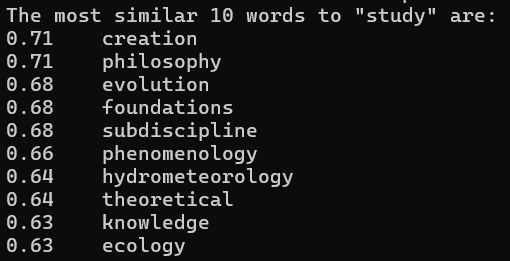
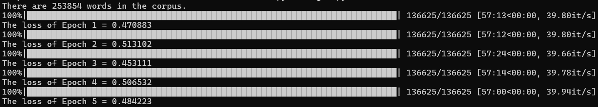
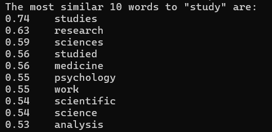

## 1. Overview

本实验分别基于SVD分解以及基于SGNS两种方法构建词向量并进行评测。

实验报告将会呈现两种算法的简介，以及分别给出各自的实验过程和结果。

## 2. SVD

### 2.1 Algorithm Introduction

矩阵的奇异值分解是指，将$m \times n$实矩阵$A$表示为以下三个实矩阵乘积形式的运算：$A = U \Sigma V ^ { T }$，其中$U$是$m$阶正交矩阵，$V$是$n$阶正交矩阵，$\Sigma$是$m \times n$矩形对角矩阵。

$\Sigma = \operatorname { diag } ( \sigma _ { 1 } , \sigma _ { 2 } , \cdots , \sigma _ { p } ) , \quad p = \operatorname { min } \{ m , n \}$，其对角线元素非负，且满足：$\sigma _ { 1 } \geq \sigma _ { 2 } \geq \cdots \geq \sigma _ { p } \geq 0$

- **左奇异矩阵$U$**：包含了词语在一个潜在语义空间中的表示
- **奇异值矩阵**$\Sigma$：对角矩阵，表示了数据的重要性或方差
- **右奇异矩阵的转置**$V^T$：包含了文档在潜在语义空间中的表示

此外，任意给定一个实矩阵，其奇异值分解一定存在，但并不唯一；奇异值分解包括紧奇异值分解和截断奇异值分解。紧奇异值分解是与原始矩阵等秩的奇异值分解，截断奇异值分解是比原始矩阵低秩的奇异值分解；奇异值分解有明确的几何解释。奇异值分解对应三个连续的线性变换：一个旋转变换，一个缩放变换和另一个旋转变换第一个和第三个旋转变换分别基于空间的标准正交基进行。在实际应用中，为了减少计算量和存储空间，通常会选取特征值最大的前$k$个进行近似。

基于SVD分解构建词向量的步骤大致如下：
1. **语料预处理**：对语料文本进行预处理，包括去除停用词、标点符号和其他无意义的字符，以及分词处理
2. **构建共现矩阵$X$**：$X_{ij}$表示词语$i$和词语$j$在一段文本中共同出现的次数
3. **SVD分解**：对共现矩阵$X$进行SVD分解，得到三个矩阵$U$、$\Sigma$和$V^T$
4. **构建词向量**：从$U$矩阵中选择前几列，得到每个词语在潜在语义空间中的向量表示，即词向量
5. **计算余弦相似度**：$\cos\theta = \frac{{\mathbf{A} \cdot \mathbf{B}}}{{\|\mathbf{A}\| \|\mathbf{B}\|}}$

### 2.2 Lab Proc

- 运行时，`main()`函数会调用`get_svd_ans()`函数，用于计算测试数据集中词对的相似度，并将结果写入文件中。在`get_svd_ans()`函数中，根据`has_train`参数的取值，决定是否需要重新训练模型。如果`has_train`为`False`，则创建一个新的SVD对象，并调用其`build_svd_vec()`方法来训练模型并保存到文件中；如果`has_train`为`True`，则加载预训练的模型。然后，读取测试数据集，逐行处理每个词对，计算它们的相似度，并将结果写入文件中。

- 接下来是`build_svd_vec()`方法。在该方法中，首先初始化一个大小为`(self.vocab_size, self.vocab_size)`的共现矩阵`co_matrix`，用于存储词的共现信息。然后，遍历语料库中的每个词，对于每个词，根据窗口大小，找出其周围的上下文词，更新共现矩阵中对应的元素。接着，将共现矩阵转换为稀疏矩阵，并调用Scipy中的稀疏矩阵奇异值分解函数`scipy.sparse.linalg.svds()`来计算词向量。最后，将得到的词向量保存到文件中。

- 在`top5()`方法中，根据`has_train`参数的取值，决定是否需要重新训练模型。如果`has_train`为`False`，则创建一个新的SVD对象，并调用其`build_svd_vec()`方法来训练模型；如果`has_train`为`True`，则加载预训练的模型。然后，给定一个词，计算它与语料库中其他词的相似度，并使用优先队列来获取相似度最高的前5个词，效果如图：

    

训练过程示意图：

### 2.3 Q&A

1. **总共有多少个非零奇异值**：
   在代码中，使用了Scipy中的稀疏矩阵奇异值分解函数`scipy.sparse.linalg.svds()`来进行奇异值分解。该函数的返回值中的奇异值向量`S`是一个包含所有奇异值的一维数组。非零奇异值的数量即为奇异值数组中非零元素的个数。

2. **选取了多少个奇异值**：
   通过参数`k=vector_dim`来指定选取的奇异值数量，其中`vector_dim`表示词向量的维度。

3. **选取的奇异值之和**：
   选取的奇异值之和即为奇异值数组`S`中前`vector_dim`个非零奇异值的总和。

4. **全部奇异值之和**：
   全部奇异值之和即为奇异值数组`S`中所有非零奇异值的总和。

5. **二者的比例**：
   选取的奇异值之和与全部奇异值之和的比例可通过相除得到。

## 3. SGNS

### 3.1 Algorithm introduction

SGNS方法是一种用于学习词向量的技术，其核心思想是通过预测上下文单词来学习每个单词的词向量。与传统的基于共现矩阵的方法相比，SGNS方法在大规模语料上的计算效率更高。

基于SGNS构建词向量的步骤大致如下：
1. **语料预处理**：与其他方法类似，对语料进行预处理，包括分词、去除停用词等。
2. **构建训练样本**：对于给定的语料，通过滑动窗口将每个单词作为中心词，选取其周围的单词作为上下文，构建训练样本。
3. **定义目标函数**：SGNS方法的目标是最大化给定中心词条件下上下文单词的概率。SGNS模型最大化条件概率是 $\prod_{w_i \in Corpus} \prod_{w_{-m} \leq j \leq w_{m}} p(w_j | w_i)$，SGNS模型的损失函数则是$-\sum_{w_i \in Corpus} \sum_{w_{-m} \leq j \leq w_{m}} \log p(w_j | w_i)$
4. **负采样**：为了提高计算效率，SGNS方法采用负采样技术来近似目标函数。在每次训练时，随机选取一些单词作为负样本，将其视为与中心词不相关，从而减少计算量。负采样的目标函数为$ \sum_{w_i \in Corpus} \log \sigma(v_{w_i}^T v_{w_j}) + \sum_{k=1}^{K} \mathbb{E}_{w_k \sim P_n(w)} [\log \sigma(-v_{w_k}^T v_{w_j})]$
5. **优化目标函数**：通过梯度下降等优化算法来调整词向量，使得模型预测的上下文单词概率与实际情况尽可能接近。
6. **生成词向量**：在训练收敛后，每个单词对应一个学习到的词向量，这些词向量可以用于后续的自然语言处理任务。

### 3.2 Lab Proc

- 运行时，`main()`函数会调用`get_sgns_ans()`函数，用于计算测试数据集中词对的相似度，并将结果写入文件中。在`get_sgns_ans()`函数中，根据`has_train`参数的取值，决定是否需要重新训练模型。如果`has_train`为`False`，则创建一个新的SGNS对象，并调用其`train()`方法来训练模型并保存到文件中；如果`has_train`为`True`，则加载预训练的模型。然后，读取测试数据集，逐行处理每个词对，计算它们的相似度，并将结果写入文件中。

- `train()`方法用于模型训练。在该方法中，首先初始化优化器`optimizer`为Adam，并设置学习率为0.001。然后，对于每个epoch，循环遍历数据加载器中的数据，获取中心词、上下文词和标签，并将它们转移到设备（GPU或CPU）上。接着，计算模型的损失，通过反向传播更新模型参数。在每个epoch结束时，输出当前epoch的损失，并保存训练好的模型参数到文件中。

- 在`load_model()`方法中，根据指定的模型路径加载预训练的模型参数。

- 在`get_cos_sim()`方法中，给定两个词，计算它们的余弦相似度。首先检查词是否在词典中，然后获取词对应的词向量，并计算它们的余弦相似度。

- 在`top5()`方法中，根据`has_train`参数的取值，决定是否需要重新训练模型。如果`has_train`为`False`，则创建一个新的SGNS对象，并调用其`train()`方法来训练模型；如果`has_train`为`True`，则加载预训练的模型。然后，给定一个词，计算它与语料库中其他词的相似度，并使用优先队列来获取相似度最高的前5个词，效果如图：

    

### 3.3 Q&A

1. 初始词向量来源：

    在`SkipGram`类的初始化方法中，使用均匀分布随机初始化词向量权重矩阵`_weight`，范围为`(-init_range, init_range)`，其中`init_range`为初始范围，这里设定为0.1。

2. 词向量维数：

    在`SkipGram`类的初始化方法中，指定了词向量的维度为`embedding_size`，这里设定为100。

3. 训练算法的学习率：

    在SGNS类的`train()`方法中，使用了Adam优化器，学习率设定为0.001。

4. 训练批次大小：

    在SGNS类的初始化方法中，创建了数据加载器`DataLoader`，并指定了批次大小为512。

5. 训练轮数：

    在SGNS类的`train()`方法中，通过循环迭代`epoch_num`次来进行模型训练，这里设定为5次。

## 4. Conclusion

### 4.1 SVD：

**优点：**

1. **全局上下文：** SVD利用了全局的词共现信息，因此可以捕捉全局语义信息，尤其适用于语料库较小但丰富的语义信息的情况。
2. **数学基础：** SVD是数学上较为严谨的方法，具有较好的数学解释性，使得结果更容易理解和解释。

**缺点：**

1. **计算复杂度高：** SVD的计算复杂度很高，尤其是在处理大规模语料库时，需要大量内存和计算资源。
2. **线性关系假设：** SVD假设词与词之间的关系是线性的，因此可能无法很好地捕捉到非线性的语义关系。
3. **固定大小的词汇表：** SVD在构建词向量时需要先定义一个固定大小的词汇表，这可能导致对少见词的处理不足。

**适用场景：**
1. **小型语料库：** 对于语料库相对较小但语义信息丰富的情况，SVD通常表现较好。
2. **高维语义表示：** 当需要得到具有较高维度的语义表示时，SVD可以提供更稳定的结果。

### 4.2 SGNS：

**优点：**

1. **高效训练：** SGNS采用了负采样等技术，大大减少了训练时间和计算资源的消耗。
2. **词频加权：** SGNS可以通过对词频进行加权处理，使得在构建词向量时更好地考虑到词频的影响。
3. **非线性关系：** SGNS能够学习到非线性的词之间的语义关系，因此能够更好地捕捉词之间的复杂语义。

**缺点：**
1. **局部上下文：** SGNS通常只考虑了局部上下文，可能无法充分利用全局语义信息，尤其在语料库较小的情况下表现不佳。
2. **超参数敏感：** SGNS中的一些超参数如负采样的数量等对最终结果有较大影响，需要仔细调整。

**适用场景：**
1. **大型语料库：** 对于大规模语料库，SGNS通常是首选，因为它的训练速度快且计算效率高。
2. **非线性语义关系：** 当语义关系较为复杂，且需要捕捉到非线性关系时，SGNS可能会表现更好。

## References

1. Tomas Mikolov, Greg Corrado, Kai Chen, Jeffrey Dean, Efficient Estimation of Word Representation in Vector Space, ICLR2013 workshop.
2. Tomas Mikolov, Llya Sutskever, Kai Chen. Distributed Representations of Words and Phrases and their Compositionality, NIPS 2013.