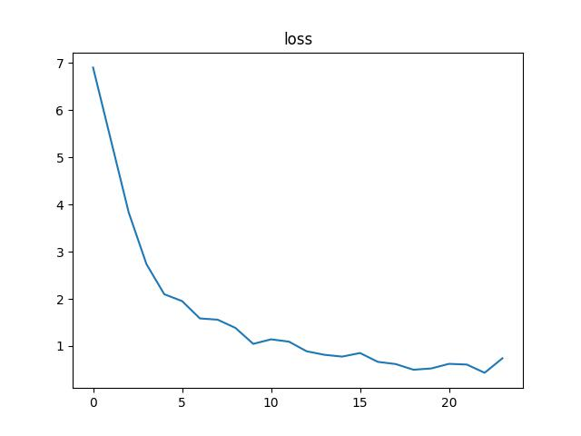
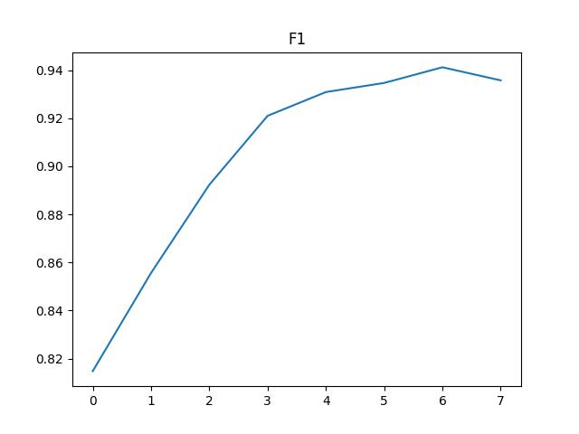
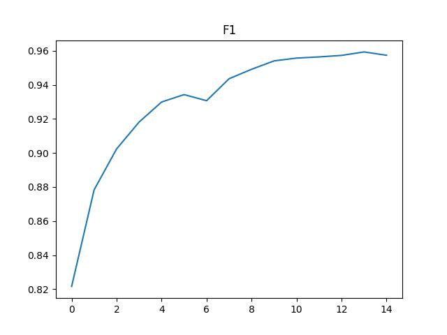

姓名：巩羽飞丨学号：2021522077丨班级：2021669101丨课程：自然语言处理

## 实验报告：基于Transformer的命名实体识别

### 1. 标签集说明

通过 `extract_labels.py` 对标签进行提取，得到以下种类的标签：

- `I_LOC`：地点实体的内部标记（Inside Location），用于标识地点实体的后续部分。
- `B_PER`：人名实体的开始标记（Begin Person），用于标识人名实体的起始部分。
- `B_ORG`：组织名实体的开始标记（Begin Organization），用于标识组织名实体的起始部分。
- `I_ORG`：组织名实体的内部标记（Inside Organization），用于标识组织名实体的后续部分。
- `I_PER`：人名实体的内部标记（Inside Person），用于标识人名实体的后续部分。
- `B_LOC`：地点实体的开始标记（Begin Location），用于标识地点实体的起始部分。
- `O`：非命名实体的标记（Outside），用于标识非命名实体的部分，或者不属于任何特定实体类别的文本。
- `B_T`：时间实体的开始标记（Begin Time），用于标识时间实体的起始部分。
- `I_T`：时间实体的内部标记（Inside Time），用于标识时间实体的后续部分。

此标签集中的这些标签通常在命名实体识别任务中使用，用于对给定的文本进行实体识别和分类。

### 2. 模型细节说明

BERT-CRF模型是一种将BERT（Bidirectional Encoder Representations from Transformers）与CRF（Conditional Random Fields）结合，用于序列标注任务，特别是命名实体识别（NER）任务的强大模型，以下是对BERT-CRF模型的简单介绍。

#### 2.1 模型结构及其结构参数

##### 2.1.1 BERT-CRF模型
- **BERT模型**：BERT是由Google提出的一种预训练语言表示模型，它采用双向Transformer架构。BERT的核心思想是通过在海量文本数据上进行预训练，学习文本的上下文表示。BERT的预训练任务包括：
  
  1. **Masked Language Model (MLM)**：随机遮掩输入序列中的一些单词，然后让模型预测这些被遮掩的单词。
  2. **Next Sentence Prediction (NSP)**：预测两个句子是否紧邻。
  
  BERT的输出是一个包含每个输入token表示的序列，这些表示包含了丰富的上下文信息。其编码可简单表示为：给定一个输入序列 $𝑋=[𝑥_1,𝑥_2,…,𝑥_𝑛]$，通过BERT编码后得到隐层表示 $𝐻=[ℎ_1,ℎ_2,…,ℎ_𝑛]$，$𝐻=BERT(𝑋)$。
  
  在本实验中，我们使用了预训练的BERT模型 `bert-base-chinese` 作为其编码器。BERT模型的主要结构参数包括：
  
  - **Transformer层数**：12层（对于 `bert-base` 模型）
  - **隐藏层大小**：768维
  - **注意力头数**：12个
  - **最大输入token数**：512个
  
- **全连接层**：在BERT的输出之后，使用了一个全连接层将BERT的输出映射到标签空间（输出维数为标签的数量）。

- **CRF层**：CRF是一种用于序列标注的概率图模型，特别擅长处理标签之间存在依赖关系的任务。CRF通过考虑标签序列的全局最优性来提高标注的准确性。在BERT-CRF模型中，BERT作为特征提取器，将输入序列映射到一个高维表示空间。然后，将这些表示作为CRF层的输入，CRF层负责对这些表示进行序列标注。在全连接层之后，使用CRF层进行标签序列解码，以建模标签之间的依赖关系。

    在CRF层，定义转移得分矩阵 $A$，其中 $A_{ij}$ 表示从标签 $i$ 转移到标签 $j$ 的得分。定义每个时间步的得分函数 $s(y_t | h_t)$，表示在时间步 $t$ 处，输出标签为 $y_t$ 的得分。序列 $Y = [y_1, y_2, \ldots, y_n]$ 的总得分 $S$ 可以表示为：

    $ S(X, Y) = \sum_{t=1}^{n} s(y_t | h_t) + \sum_{t=1}^{n-1} A_{y_t, y_{t+1}} $

    CRF层的目标是最大化正确标签序列的得分，同时最小化所有可能标签序列的得分之和。通过softmax来计算每个标签序列的概率：

    $ P(Y|X) = \frac{\exp(S(X, Y))}{\sum_{Y'} \exp(S(X, Y'))} $

    而训练过程通过最大化对数似然估计来进行。

##### 2.1.2 预处理部分
- **初始字向量**：使用腾讯AI实验室提供的中文词向量文件 `tencent-ailab-embedding-zh-d100-v0.2.0-s.bin` ，这些词向量是基于Word2Vec训练的。
  - **向量维数**：100维

##### 2.1.3 为什么BERT-CRF适合NER任务

1. **上下文信息丰富**：BERT的双向编码能够捕捉到文本的上下文信息，这是识别命名实体（如人名、地名等）所必需的，因为实体识别通常依赖于上下文。
2. **标签依赖处理能力强**：NER任务中，标签之间存在很强的依赖关系（例如，`B-PER` 后面通常跟着 `I-PER`）。CRF层通过建模标签之间的转移概率，能够有效地捕捉这些依赖关系，提高标注的准确性。
3. **端到端训练**：BERT-CRF模型可以端到端训练，使得特征提取和序列标注过程无缝结合，优化效果更好。
4. **处理长序列能力**：BERT能够处理长文本序列，并且可以通过分段处理（使用特殊的 `[SEP]` 标记）来有效地处理超长文本。

#### 2.2 数据处理

##### 2.2.1 数据集
- **`NerDataset` 类**：定义了NER任务的数据集类，使用BERT的tokenizer对输入文本进行tokenization，并将标签转化为张量。
- **`padding_collate` 函数**：自定义的collate函数，用于将不同长度的序列进行padding。

#### 2.3 训练部分

##### 2.3.1 训练参数
- **训练算法**：使用Adam优化器 `torch.optim.Adam`。
- **学习率**：0.001
- **训练批次大小**：512
- **训练轮数**：3轮

##### 2.3.2 训练流程
- **数据加载**：通过 `DataLoader` 加载训练和开发数据集，并使用自定义的collate函数进行padding。
- **模型训练**：在每个训练轮次中，模型进行前向传播、计算损失、反向传播并更新参数。
  - **损失计算**：在训练过程中，使用CRF层的前向算法计算负对数似然损失。
- **模型评估**：在开发集上进行评估，计算F1分数。

#### 2.4 预测部分

##### 2.4.1 预测流程
- **数据预处理**：将测试集的文本进行预处理和tokenization。
- **模型预测**：加载训练好的模型，对测试集进行预测并解码得到标签序列。
- **结果保存**：将预测的标签结果保存到文件中。

#### 2.5 可视化
- **损失曲线**：训练过程中，记录并绘制损失曲线，具体见下文。
- **F1分数曲线**：训练过程中，记录并绘制F1分数曲线，具体见下文。

#### 2.6 代码示例
以下是代码的主要部分示例：

```python
class BertCrf(nn.Module):
    def __init__(self, output_size, tokenizer, bert_model_name='bert-base-chinese'):
        super(BertCrf, self).__init__()
        self.tokenizer = tokenizer
        self.bert = BertModel.from_pretrained(bert_model_name)
        self.hidden_size = self.bert.config.hidden_size
        self.fc = nn.Linear(self.hidden_size, output_size)
        self.crf = CRF(output_size)

    def forward(self, inputs, target, is_predict=False):
        bert_output = self.bert(**inputs).last_hidden_state
        logits = self.fc(bert_output)
        if not is_predict:
            mask = inputs['attention_mask'].bool()
            loss = -self.crf.forward(logits, target, mask=mask)
            return loss
        else:
            mask = inputs['attention_mask'].bool()
            decode = self.crf.viterbi_decode(logits, mask=mask)
            return decode
```

训练和预测的代码如下所示：

```python
def train(max_epoch, batch_size, bert_model_path, save_path='model/model_bert.pth'):
    device = 'cuda' if torch.cuda.is_available() else 'cpu'
    pre = Preprocess(bert_model_path=bert_model_path)
    tokenizer = pre.tokenizer
    train_corpus, train_tags = pre.preprocess_corpus('train.txt', 'train_TAG.txt', has_tag=True)
    dev_corpus, dev_tags = pre.preprocess_corpus('dev.txt', 'dev_TAG.txt', has_tag=True)
    train_dataset = NerDataset(train_corpus, train_tags, tokenizer)
    dev_dataset = NerDataset(dev_corpus, dev_tags, tokenizer)
    train_dataloader = DataLoader(train_dataset, batch_size=batch_size, collate_fn=padding_collate, shuffle=True)
    dev_dataloader = DataLoader(dev_dataset, batch_size=batch_size, collate_fn=padding_collate, shuffle=True)

    model = BertCrf(output_size=len(pre.tag2id), tokenizer=tokenizer).to(device)
    optimizer = torch.optim.Adam(model.parameters(), lr=0.001)

    for epoch in range(max_epoch):
        print(f'Epoch {epoch + 1}/{max_epoch}')
        model.train()
        for i, (inputs, labels) in tqdm(enumerate(train_dataloader), total=len(train_dataloader)):
            inputs = {key: val.to(device) for key, val in inputs.items()}
            labels = labels.to(device)
            optimizer.zero_grad()
            loss = model(inputs, labels)
            loss.backward()
            optimizer.step()
```

### 3. 指标统计

  

综上，本实验训练了7个Epoch，在验证集上的loss达到0.01，同时F1分数达到94.32。

此外，我们可以观察到，F1先升高，到Epoch7之后又降低，同时loss也先降低再升高；此外，当继续进行训练到Epoch8的时候，F1开始回升，并逐渐超过原来的最高值，可能的原因如下：

#### 3.1 过拟合

- **现象**：在训练初期，模型的F1得分上升，Loss下降，表明模型正在学习数据的特征。然而，到达某个点后，F1得分开始下降，而Loss开始上升，表明模型可能开始过拟合训练数据。
- **解释**：过拟合发生在模型在训练集上表现很好，但在验证集或测试集上表现较差。此时，模型已经开始记住训练数据中的噪音和细节，而不是学习到泛化的特征。
- **解决方案**：
  - **增加正则化**：使用L2正则化或Dropout层来减少模型的过拟合。
  - **数据增强**：通过数据增强技术生成更多的训练样本，提高模型的泛化能力。
  - **早停**：监控验证集的性能，并在性能开始下降时提前停止训练。
  - **减小模型复杂度**：减少模型的参数数量，降低模型的复杂度。

#### 3.2 学习率问题

- **现象**：如果学习率设置不合适，可能导致在某些Epoch中模型的性能波动。比如，学习率太高，模型的参数更新过大，导致模型在优化过程中震荡，性能波动较大。
- **解释**：学习率的设置对训练过程有很大影响。较高的学习率可能使模型在收敛过程中跳过最优点，而较低的学习率则可能使模型收敛速度过慢。
- **解决方案**：
  - **学习率调度**：在训练过程中逐步降低学习率，可以使用学习率调度器。
  - **动态学习率调整**：使用方法如 `ReduceLROnPlateau`，在验证性能没有提升时，自动降低学习率。

#### 3.3 训练数据的变化和模型的重新适应

- **现象**：继续训练时，F1得分再次上升并超过之前的最高值，表明模型在进一步训练过程中重新适应数据，找到了更好的泛化解。
- **解释**：这可能是由于**模型在过拟合后重新找到数据的全局特征**，即模型在一定程度上跳出了局部最优，找到了更好的全局最优。

### 4. 参考文献

1. Devlin, J., Chang, M.-W., Lee, K., and Toutanova, K. 2019. BERT: Pre-training of Deep Bidirectional Transformers for Language Understanding. In *Proceedings of the 2019 Conference of the North American Chapter of the Association for Computational Linguistics: Human Language Technologies, Volume 1 (Long and Short Papers)* (NAACL-HLT 2019), 4171–4186. Association for Computational Linguistics.
2. Lample, G., Ballesteros, M., Subramanian, S., Kawakami, K., and Dyer, C. 2016. Neural Architectures for Named Entity Recognition. In *Proceedings of the 2016 Conference of the North American Chapter of the Association for Computational Linguistics: Human Language Technologies* (NAACL-HLT 2016), 260–270. Association for Computational Linguistics.
3. Huang, Z., Xu, W., and Yu, K. 2015. Bidirectional LSTM-CRF Models for Sequence Tagging. arXiv preprint arXiv:1508.01991.
4. Ma, X., and Hovy, E. 2016. End-to-end Sequence Labeling via Bi-directional LSTM-CNNs-CRF. In *Proceedings of the 54th Annual Meeting of the Association for Computational Linguistics (Volume 1: Long Papers)* (ACL 2016), 1064–1074. Association for Computational Linguistics.
5. Akbik, A., Bergmann, T., Blythe, D., Rasul, K., Schweter, S., and Vollgraf, R. 2019. FLAIR: An Easy-to-Use Framework for State-of-the-Art NLP. In *Proceedings of the 2019 Conference of the North American Chapter of the Association for Computational Linguistics (Demonstrations)* (NAACL-HLT 2019), 54–59. Association for Computational Linguistics.
6. Peters, M. E., Neumann, M., Iyyer, M., Gardner, M., Clark, C., Lee, K., and Zettlemoyer, L. 2018. Deep Contextualized Word Representations. In *Proceedings of the 2018 Conference of the North American Chapter of the Association for Computational Linguistics: Human Language Technologies, Volume 1 (Long Papers)* (NAACL-HLT 2018), 2227–2237. Association for Computational Linguistics.
7. Akbik, A., Blythe, D., and Vollgraf, R. 2018. Contextual String Embeddings for Sequence Labeling. In *Proceedings of the 27th International Conference on Computational Linguistics* (COLING 2018), 1638–1649. Association for Computational Linguistics.
8. Chiu, J. P. C., and Nichols, E. 2016. Named Entity Recognition with Bidirectional LSTM-CNNs. *Transactions of the Association for Computational Linguistics*, 4, 357–370.
9. Collobert, R., Weston, J., Bottou, L., Karlen, M., Kavukcuoglu, K., and Kuksa, P. 2011. Natural Language Processing (Almost) from Scratch. *Journal of Machine Learning Research*, 12, 2493–2537.
10. Liu, Y., Ott, M., Goyal, N., Du, J., Joshi, M., Chen, D., Levy, O., Lewis, M., Zettlemoyer, L., and Stoyanov, V. 2019. RoBERTa: A Robustly Optimized BERT Pretraining Approach. arXiv preprint arXiv:1907.11692.

大模型辅助情况：仅用于帮助定位报错原因和提供报告框架